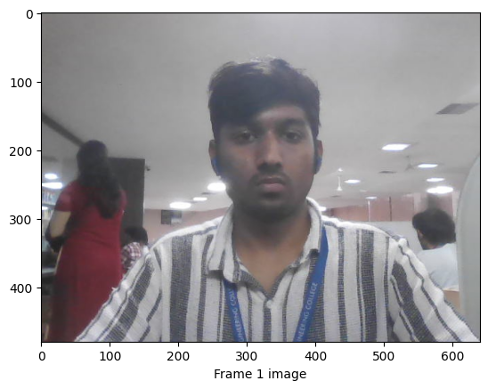
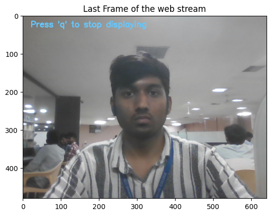
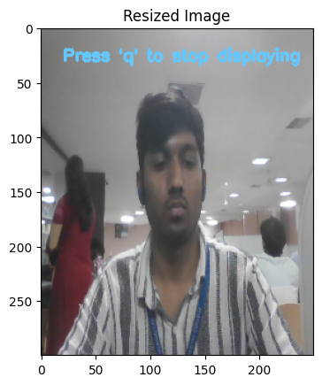
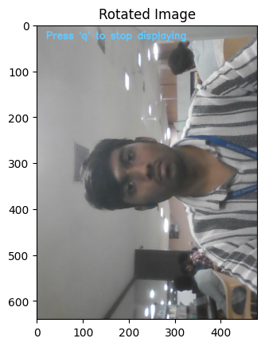

Aim:
 
To write a python program using OpenCV to capture the image from the web camera and do the following image manipulations.
i) Write the frame as JPG 
ii) Display the video 
iii) Display the video by resizing the window
iv) Rotate and display the video

## Software Used
Anaconda - Python 3.7
## Algorithm
### Step 1:
<br>
 * Import the required libraries (cv2, numpy, matplotlib).
### Step 2:
<br>
* Open the web camera using cv2.VideoCapture(0).

### Step 3:
<br>
* Capture frames from the webcam using .read().

### Step 4:
<br>
* Perform the required manipulations:

### Step 5:
<br>
* Display the processed video in a window until the user presses the 'q' key. Finally, release the camera and close all OpenCV windows.

## Program:

``` Python
### Developed By: Sanjay Sivaramakrishnan M
### Register No: 212223240151

## i) Write the frame as JPG file

videoCaptureObject = cv2.VideoCapture(0)
frame_count = 0
while frame_count < 5:
    ret,frame = videoCaptureObject.read()
    frame_name = f'frame_{frame_count+1}.jpg'
    cv2.imwrite(frame_name,frame)
    cv2.imshow("pic.jpg",frame)
    frame_count+=1

# display the first captured image
image = cv2.imread('frame_1.jpg')
plt.imshow(image[:,:,::-1])
plt.xlabel("Frame 1 image")
plt.show()

videoCaptureObject.release()
cv2.destroyAllWindows()


## ii) Display the video

## ii) Display the video
import cv2
videoCaptureObject = cv2.VideoCapture(0)

while True:
    ret,frame = videoCaptureObject.read()
    cv2.putText(frame,"Press 'q' to stop displaying",(20,30),cv2.FONT_HERSHEY_SIMPLEX,0.7,(255,200,100),2)
    cv2.imshow('Web Image',frame)
    if cv2.waitKey(1) & 0xFF == ord('q'):
        break

#for inline visualization
plt.imshow(frame[:,:,::-1])   # Last frame
plt.title("Last Frame of the web stream")    
videoCaptureObject.release()
cv2.destroyAllWindows()


## iii) Display the video by resizing the window

## iii) Display the video by resizing the window
import cv2
import numpy as np
cap = cv2.VideoCapture(0)
while True:
    ret, frame = cap.read()
    if not ret:
        break
    resized_frame = cv2.resize(frame,(250,300))
    cv2.putText(resized_frame,"Press 'q' to stop displaying",(20,30),cv2.FONT_HERSHEY_SIMPLEX,0.5,(255,200,100),2)
    cv2.imshow('myimage', resized_frame)
    if cv2.waitKey(1) == ord('q'):
        break

#for inline visualization
plt.imshow(resized_frame[:,:,::-1])   # Last frame
plt.title("Resized Image")
cap.release()
cv2.destroyAllWindows()


## iv) Rotate and display the video
## iv) Rotate and display the video
import cv2
import numpy as np
cap = cv2.VideoCapture(0)
while True:
    ret, frame = cap.read()
    if not ret:
        break
    rotated_image = cv2.rotate(frame,cv2.ROTATE_90_COUNTERCLOCKWISE)
    cv2.putText(rotated_image,"Press 'q' to stop displaying",(20,30),cv2.FONT_HERSHEY_SIMPLEX,0.7,(255,200,100),2)
    cv2.imshow('Image rotated 90 degree couterclockwise', rotated_image)
    if cv2.waitKey(1) == ord('q'):
        break

#for inline visualization
plt.imshow(rotated_image[:,:,::-1])   # Last frame
plt.title("Rotated Image")    
cap.release()
cv2.destroyAllWindows()


```
## Output

### i) Write the frame as JPG image
</br>

</br>


### ii) Display the video
</br>

</br>


### iii) Display the video by resizing the window
</br>

</br>


### iv) Rotate and display the video
</br>

</br>


## Result:
Thus the image is accessed from webcamera and displayed using openCV.
